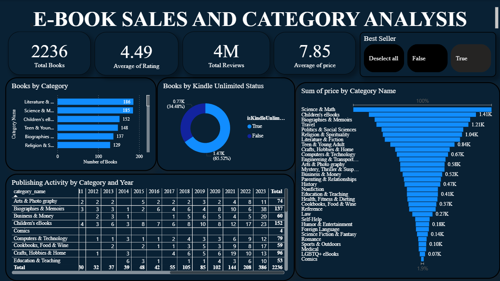

# Ebook Sales and Categorical Analysis

A Power BI project designed to analyze Kindle book sales performance, trends, and key metrics for better publishing insights.

## 📘 Project Overview

This project explores Kindle book performance using sales data. The dashboard highlights trends in genre-wise performance, pricing impact, reader engagement, and revenue contributions. It helps authors or publishers identify which books drive sales and which areas need improvement.

## 📊 Tools & Technologies

- Power BI (Data Modeling, Dashboard Design)
- Microsoft Excel (Data Cleaning and Transformation)
- DAX (for custom calculations and KPIs)

## 📸 Screenshots

### Sales Dashboard Overview  

## 📂 Dataset

The dataset includes Kindle book metadata, sales numbers, ratings, and pricing details. *(Sample data used for educational purposes)*

